# DIU24
Prácticas Diseño Interfaces de Usuario 2023-24 (Tema: .... ) 

Grupo: DIU3_Designers.  Curso: 2023/24 
Updated: 17/3/2024

Proyecto: 
>>> Decida el nombre corto de su propuesta en la práctica 2 

Descripción: 

>>> Describa la idea de su producto en la práctica 2 

Logotipo: 
>>> Opcionalmente si diseña un logotipo para su producto en la práctica 3 pongalo aqui

Miembros
 * :bust_in_silhouette:   Pablo Garcia Guijosa    :octocat:     
 * :bust_in_silhouette:  Brandon René Morales Viracocha     :octocat:

----- 

# Proceso de Diseño 

## Paso 1. UX User & Desk Research & Analisis 

 **1.a User Reseach Plan**
-----

Hemos hecho un user research acerca de la pagina GranaVentour debido a que tenemos algo de experiencia con la temática.
[Aqui puede verlo completo](https://github.com/rn2k00/DIU3.designers/blob/master/P1/DIU-p1-1-userResearch.pdf)

 1.b Competitive Analysis
-----

Según la comparativa, podemos notar que la página web elegida, aunque presente varios problemas de diseño y de experiencia de usuario, no es la única. Otras dos páginas de la misma temática, presentan problemas parecidos, como pueden ser la falta de horarios, la ausencia de estimaciones sobre la duración de las actividades, estimaciones del precio de la actividad, o direcciones de llegada al punto de realización de la misma.

Se puede ver que los problemas que afectan a esta página particular son prevalentes en un ámbito bastante grande, aunque es cierto que la página web elegida presenta determinados problemas de diseño, distintos a las otras, como pueden ser una barra de búsqueda no funcional o la presencia de demasiados modos de acceso a las actividades (barras de búsqueda, menús (que presentan poca información sobre actividades concretas), o un carrusel de imágenes con las actividades, más abajo en la página), que podrían confundir al usuario.

En conclusión, la página, aún no siendo la única con carencias, presenta ciertos problemas que hacen que la experiencia de usuario se ve empeorada, y cuya solución no es demasiado compleja ni difícil. 
Desarrollamos este tema en nuestro [Analisis Competitivo](https://github.com/rn2k00/DIU3.designers/blob/master/P1/DIU-p1-2-competitive.pdf)

 

 1.c Persona
-----

Nuestros personajes reflejan dos posibles usuarios de la página en cuestión. Uno es un usuario más novato y hace referencia al usario cotidiano y público en general, mientras que el otro refleja a un usuario experto, que tiene una serie de necesidades más avanzadas que una persona cotidiana, además de necesitar mayor control sobre las experiencias en cuestión.

La primera persona, se trata de una mujer no familiarizada con este tipo de actividades, aunque está dispuesta a probarlas. Por ello, no sabe qué debería esperar de este tipo de actividades ni de una página que las oferta.

La segunda, se trata de un hombre aficionado a las actividades ofertadas, que busca un medio rápido y sencillo de poder realizarlas sin complicaciones. Es por ello, que es un tipo de cliente más exigente y que puede detectar mejor ciertas carencias, pues sabe lo que quiere y lo que se debería ofertar.
 
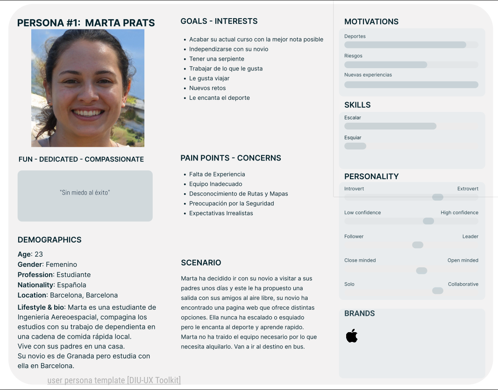 
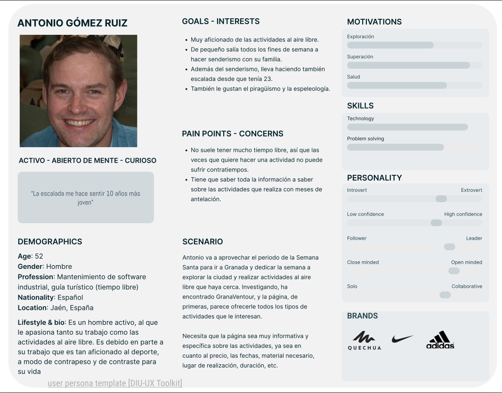 

 1.d User Journey Map
----

Reflejan correctamente una situación real, comenzando sin problema, hasta encontrarse con las carencias de la página. Es tras presenciar estas carencias cuando la experiencia empieza a empeorar, produciendo finalmente que el usuario se sienta bastante frustrado con la experiencia de uso.

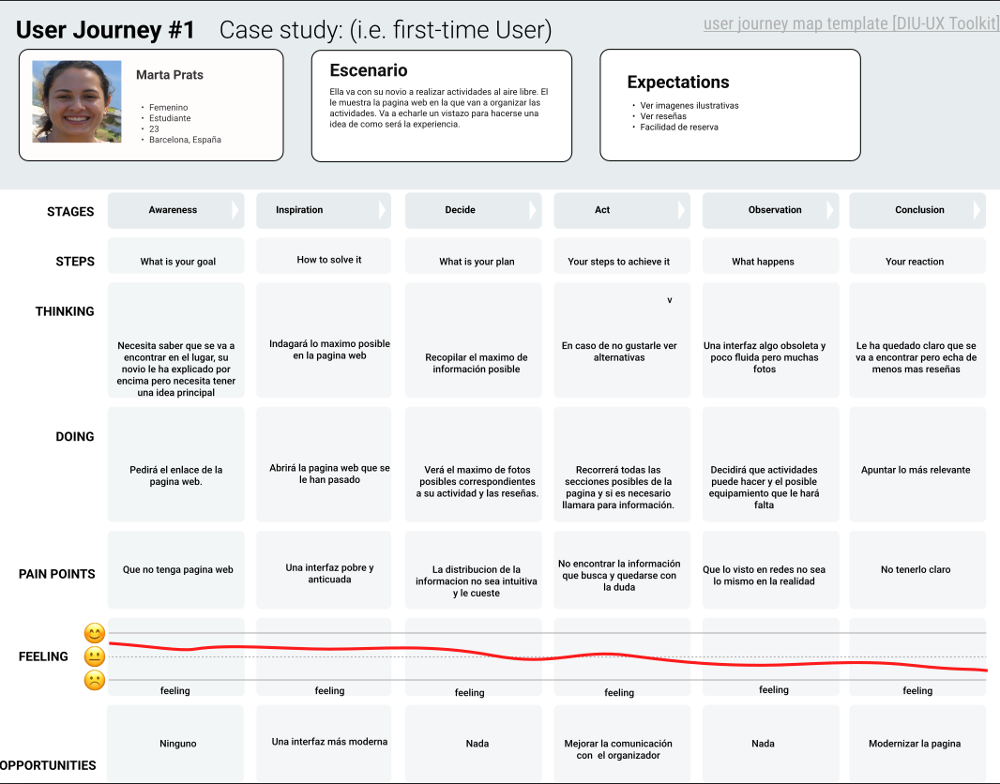 

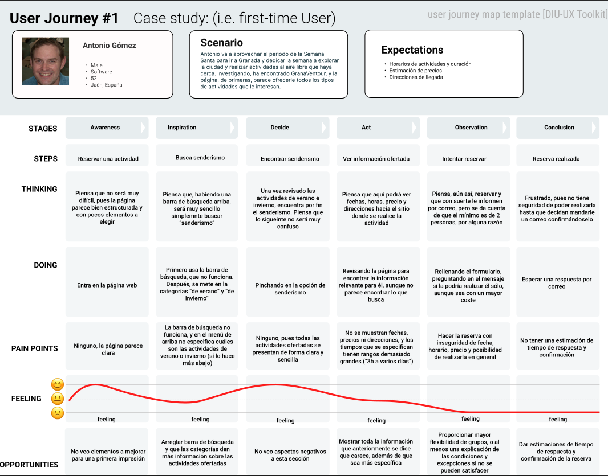 

 1.e Usability Review
----
>>> - Enlace al documento: [Usability Review](https://github.com/rn2k00/DIU3.designers/blob/master/P1/DS-p1-5-usability%20-%20Usability%20scores.pdf) 
>>> - Valoración final (numérica): 59
 
>>> - Comentario sobre la valoración:  Tras analizar exhaustivamente el sitio web GranaVentour, hemos otorgado una puntuación de 59 sobre 100, indicando áreas de mejora clave en la experiencia del usuario (UX) y usabilidad. Recomendamos enfocarse en mejorar la funcionalidad, implementando una función de horarios y precios. Además, se sugiere diversificar la oferta de actividades y mejorar la funcion de reserva y búsqueda. Al abordar estas áreas, GranaVentour puede mejorar su plataforma y aumentar la satisfacción y compromiso de los usuarios.

## Paso 2. UX Design  

 2.a Reframing / IDEACION: Feedback Capture Grid / EMpathy map 
----

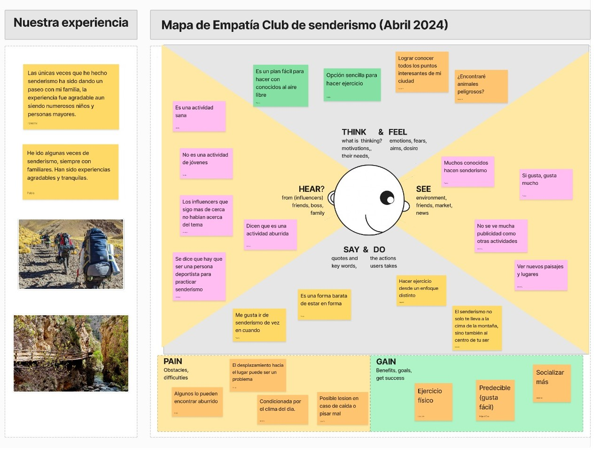 

 2.b ScopeCanvas
----
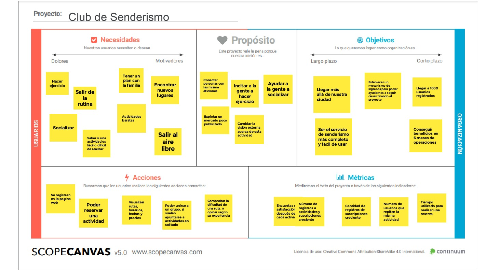 

 2.b User Flow (task) analysis 
-----

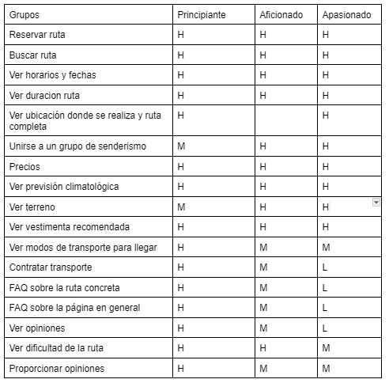
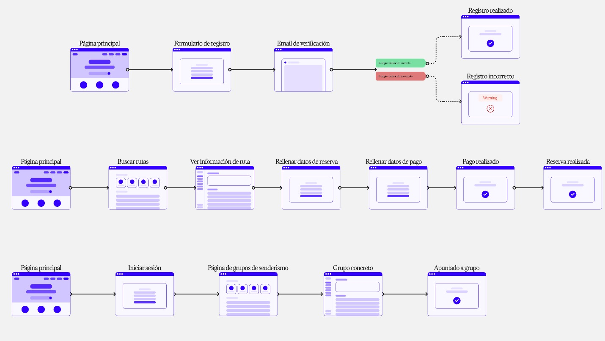 

 2.c IA: Sitemap + Labelling 
----
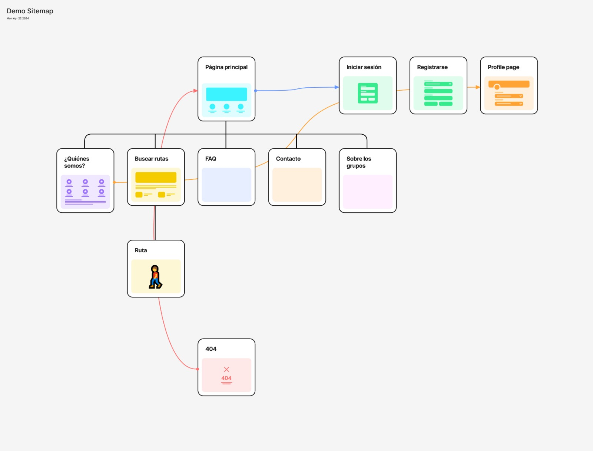 
 

 2.d Wireframes
-----

>>> Plantear el  diseño del layout para Web/movil (organización y simulación ) 

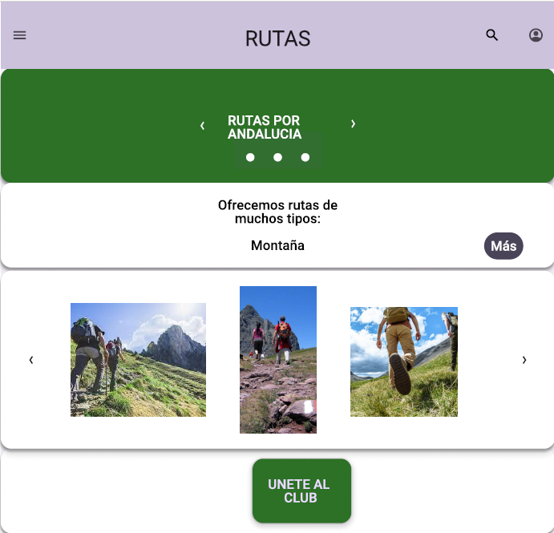 
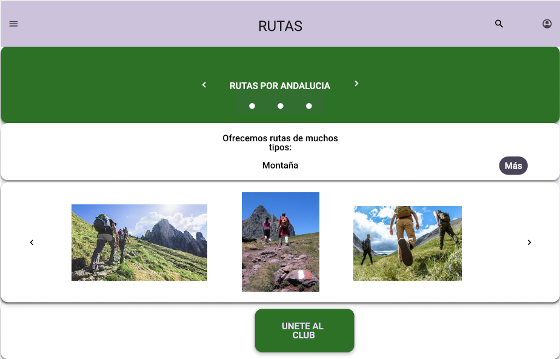 

## Paso 3. Mi UX-Case Study (diseño)

 3.a Moodboard
-----

>>> Plantear Diseño visual con una guía de estilos visual (moodboard) 
>>> Incluir Logotipo
>>> Si diseña un logotipo, explique la herramienta utilizada y la resolución empleada. ¿Puede usar esta imagen como cabecera de Twitter, por ejemplo, o necesita otra?

  3.b Landing Page
----

>>> Plantear Landing Page 

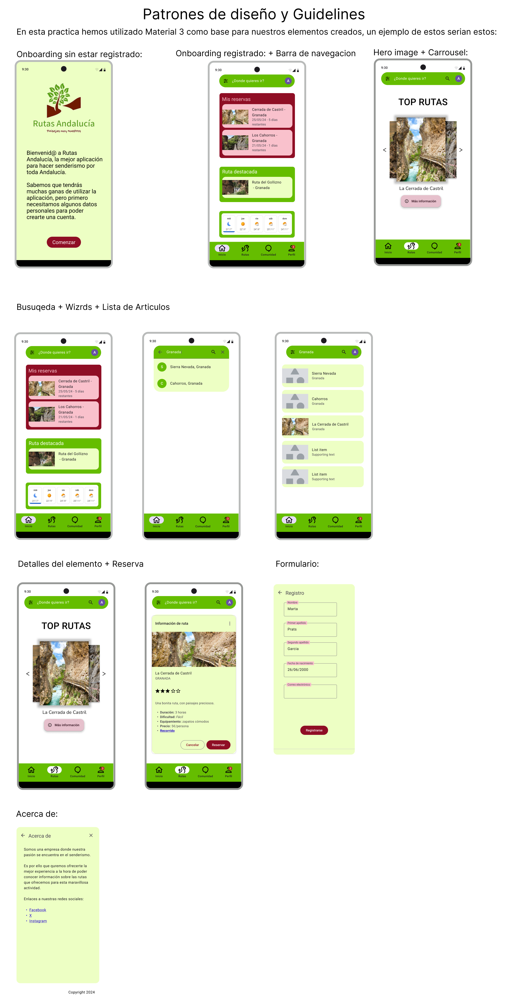 3.c Guidelines
----

>>> Estudio de Guidelines y Patrones IU a usar 
>>> Tras documentarse, muestre las deciones tomadas sobre Patrones IU a usar para la fase siguiente de prototipado. 

  3.d Mockup
----

>>> Layout: Mockup / prototipo HTML  (que permita simular tareas con estilo de IU seleccionado)

 3.e ¿My UX-Case Study?
-----

>>> Publicar my Case Study en Github..
>>> Documente y resuma el diseño de su producto

## Paso 5. Exportación & evaluación con Eye Tracking 

Exportación a HTML/Flutter
-----

)  5.b Eye Tracking method 

>>> Indica cómo diseñas experimento y reclutas usuarios (uso de gazerecorder.com)  

Diseño del experimento 
----

>> Uso de imágenes (preferentemente) -> hay que esablecer una duración de visualización y  
>> fijar las áreas de interes (AoI) antes del diseño. Planificar qué tarea debe hacer el usuario (buscar, comprar...) 

  
>> cambiar img por tu diseño de experimento  

>> Recordar que gazerecorder es una versión de pruebas: usar sólo con 3 usuarios para generar mapa de calor (recordar que crédito > 0 para que funcione) 

Resultados y valoración 
-----

>> Cambiar por tus resultados
  

## Paso 4. Evaluación 

 4.a Caso asignado
----

>>> Breve descripción del caso asignado con enlace a  su repositorio Github

 4.b User Testing
----

>>> Seleccione 4 personas ficticias. Exprese las ideas de posibles situaciones conflictivas de esa persona en las propuestas evaluadas. Asigne dos a Caso A y 2 al caso B
 

| Usuarios | Sexo/Edad     | Ocupación   |  Exp.TIC    | Personalidad | Plataforma | TestA/B
| ------------- | -------- | ----------- | ----------- | -----------  | ---------- | ----
| User1's name  | H / 18   | Estudiante  | Media       | Introvertido | Web.       | A 
| User2's name  | H / 18   | Estudiante  | Media       | Timido       | Web        | A 
| User3's name  | M / 35   | Abogado     | Baja        | Emocional    | móvil      | B 
| User4's name  | H / 18   | Estudiante  | Media       | Racional     | Web        | B 

 4.c Cuestionario SUS
----

>>> Usaremos el **Cuestionario SUS** para valorar la satisfacción de cada usuario con el diseño (A/B) realizado. Para ello usamos la [hoja de cálculo](https://github.com/mgea/DIU19/blob/master/Cuestionario%20SUS%20DIU.xlsx) para calcular resultados sigiendo las pautas para usar la escala SUS e interpretar los resultados
http://usabilitygeek.com/how-to-use-the-system-usability-scale-sus-to-evaluate-the-usability-of-your-website/)
Para más información, consultar aquí sobre la [metodología SUS](https://cui.unige.ch/isi/icle-wiki/_media/ipm:test-suschapt.pdf)

>>> Adjuntar captura de imagen con los resultados + Valoración personal 

 4.d Usability Report
----

>> Añadir report de usabilidad para práctica B (la de los compañeros)

>>> Valoración personal 

5.) Conclusion de EVALUACION (A/B testing + usability report + eye tracking) 
----

>> recupera el usability report de tu práctica (que es el caso B de los asignados a otros grupos) 
>> con los resultados del A/B testing, de eye tracking y del usability report:
>>  comentad en 2-3 parrafos cual es la conclusion acerca de la realización de la práctica y su evaluación con esas técnicas y que habéis aprendido

## Conclusión final / Valoración de las prácticas

>>> (90-150 palabras) Opinión FINAL del proceso de desarrollo de diseño siguiendo metodología UX y valoración (positiva /negativa) de los resultados obtenidos  

